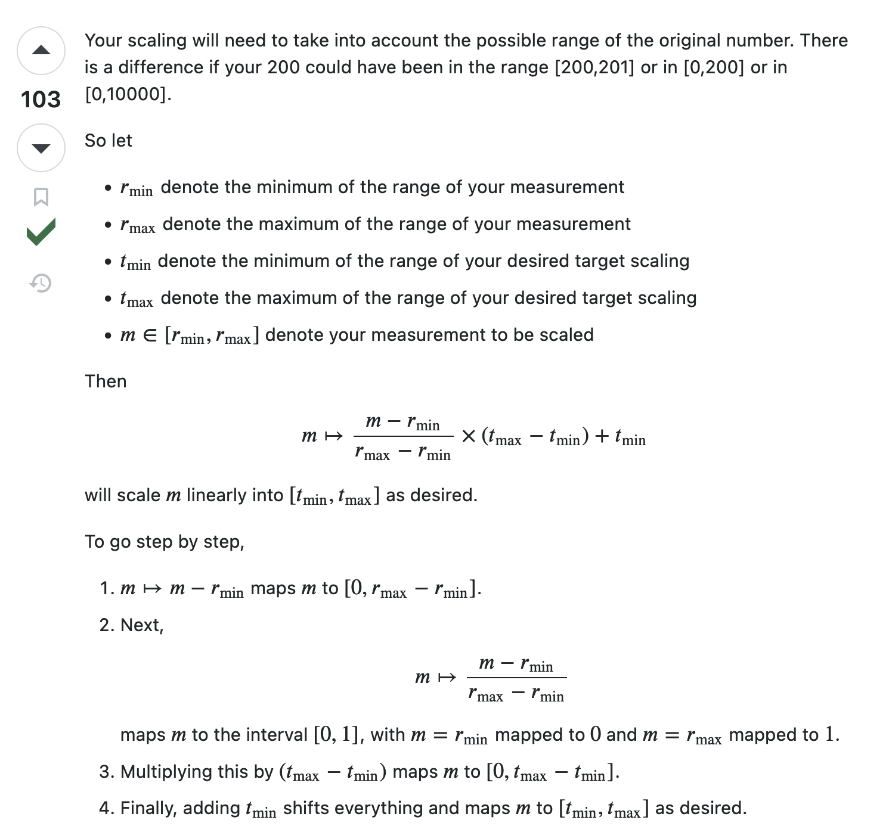

To scale $x$ into target range $[a, b]$ 

$$
x_{normalized} = (b-a)\frac{x - min(x)}{max(x) - min(x)} + a
$$

Example,
Scaling $[0,60]$ minute to $[0, 1]$ range such that 30 minute will be expressed as 0.5 normalized value.

$$
\begin{aligned}
x_{normalized} = (1-0)\frac{x - 0}{60 - 0} + 0 \\
\\
\text{substiute arbitary value into x such as 30,}\\
\\
0.5 = (1-0)\frac{30 - 0}{60 - 0} + 0

\end{aligned}
$$

## Reference pulled from internet
